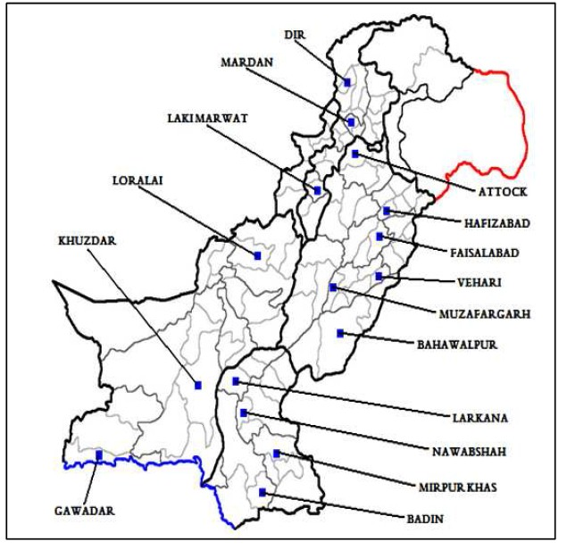

# pphsdata: Pakistan Panel Household Survey (PPHS) Data

## Introduction
The **Pakistan Panel Household Survey (PPHS)** is a major initiative by the Pakistan Institute of Development Economic (PIDE) and World Bank to maintain a panel dataset covering a wide range of socio-economic and demographic topics. In 2001 the PIDE decided to revisit the IFPRI panel households that were surveyed in 1990-1991- a gap of 10 years. The sample was expanded from the four districts included in the IFPRI sample to 16 districts, adding districts from all the four provinces of Pakistan. Continuing to be a rural survey, it was named the **Pakistan Rural Household Survey (PRHS)**. The second round of the PRHS was carried out in 2004 while the third round was completed in 2010. The third round marked the addition of the urban sample to the existing survey design of the PRHS leading the survey to its current name, the Pakistan Panel Household Survey (PPHS).

*The districts included in the PPHS are shown below in the map.*

This website is a one-stop centre for all the three rounds of the PPHS-PRHS 2001, 2004 and 2010. Data and questionnaires of the PPHS-PRHS would be available to all for academic purposes using the protocol defined in the relevant sections of this website. The website also provides, or links to, all the research conducted using the PPHS-PRHS dataset(s). All those requesting the data in future are advised to share their research (at least a weblink) with us so that it is included in the website for better dissemination.